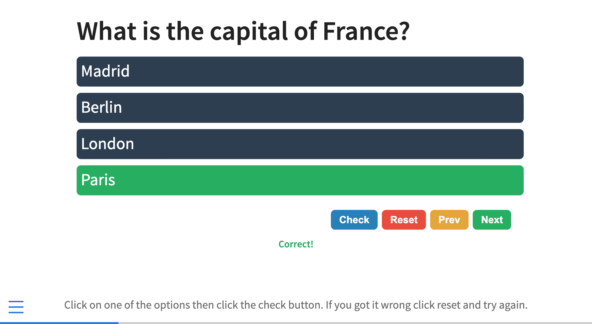

# Quiz Extension For Quarto

Simple RevealJS extension that allows you to create multiple choice quiz questions in Quarto.

Here's an example of what this extension looks like: 



## Installing

This will install the extension under the `_extensions` subdirectory.
If you're using version control, you will want to check in this directory.

```bash
quarto add parmsam/quarto-quiz
```

## Using

Simply add the extension to the list of revealjs plugins like:

``` yaml
title: My Presentation
format:
    revealjs: default
revealjs-plugins:
  - quiz
```

Then use the following syntax within a slide to create a quiz question. There will be a button for each option and buttons to check or reset each question.

``` markdown
## Quiz question goes here {.quiz-question}

- Option 1
- [Option 2 which is correct]{.correct}
- Option 3
- Option 4
```

By default, the keyboard shortcut to check the quiz question is 'c'. You can change this by setting the `checkKey` option in your YAML header like:

```yaml
title: "Multiple Choice Quiz Example"
format:
  revealjs:
    quiz: 
      checkKey: 'c'
      resetKey: 'q'
      shuffleKey: 't'
      allowNumberKeys: true
      disableOnCheck: false
      disableReset: false
      shuffleOptions: true
      defaultCorrect: "Correct!"
      defaultIncorrect: "Incorrect!"
      includeScore: false
revealjs-plugins:
  - quiz
```

You'll also notice a `resetKey` and `shuffleKey` option. These are the keys to reset an individual quiz question and shuffle all the quiz questions respectively. By default they're set to 'q' and 't'. You can change these to any key you like.

You can also set the `allowNumberKeys` option to `true` to allow users to select an answer by pressing the number key corresponding to the option. For example, if the correct answer is the second option, the user can press '2' to select the correct answer.

The `disableOnCheck` option will disable the quiz question after it has been checked. This means that the user can't change their answer after they've checked it unless they reset the question. This is false by default. 

The `disableOnReset` options will disable the quiz question reset button across all questions. This means the user can't reset the question after they've checked it. This is false by default. Note that they can still check other questions if the `disableOnCheck` option is false. It can be used along with `disableOnCheck` to prevent the user from changing their answer after they've checked it (unless they refresh their browser page to reset all questions). 

The `shuffleOptions` option will shuffle the order of the options when the question is displayed. This is true by default. You can refresh your browser to reshuffle the options. 

The `defaultCorrect` and `defaultIncorrect` options allow you to set the default text for the correct and incorrect explanations. By default, they are set to "Correct!" and "Incorrect!" if you don't define them.

### Including current score in each slide

The `includeScore` option will include a score in the middle bottom of each slide. It wil; be formatted as "A% Correct (X/Y)" where A is the percentage of correct answers and X and Y are the number of correct and total questions respectively. Note that this option will disable the reset button after an answer check to ensure the running score is accurate. The check button will still be enabled, unless you use `disableOnCheck`. This is false by default. 

### Custom explanations for each option

Within a slide, you can use the `data-explanation` attribute to provide an explanation for the each option including the correct answer. It is a [data attribute](https://developer.mozilla.org/en-US/docs/Learn/HTML/Howto/Use_data_attributes), in case you are wondering why it has a "data-*" prefix. This will be displayed when the user checks their answer. For example, here's what a math quiz question might look like:

``` markdown
## What is the formula for the area of a circle? {.quiz-question}

- [$πr^2$]{.correct}
- [$2πr$]{data-explanation="This is the formula for the circumference of a circle."}
- [$4πr^2$]{data-explanation="This is the formula for the surface area of a sphere."}
- [$\frac{4}{3}r^3$]{data-explanation="This is the formula for the volume of a sphere."}
```

## Example

Here is the source code for a minimal example: [example.qmd](example.qmd).

The output of `example.qmd` is [here](https://parmsam.github.io/quarto-quiz/).
